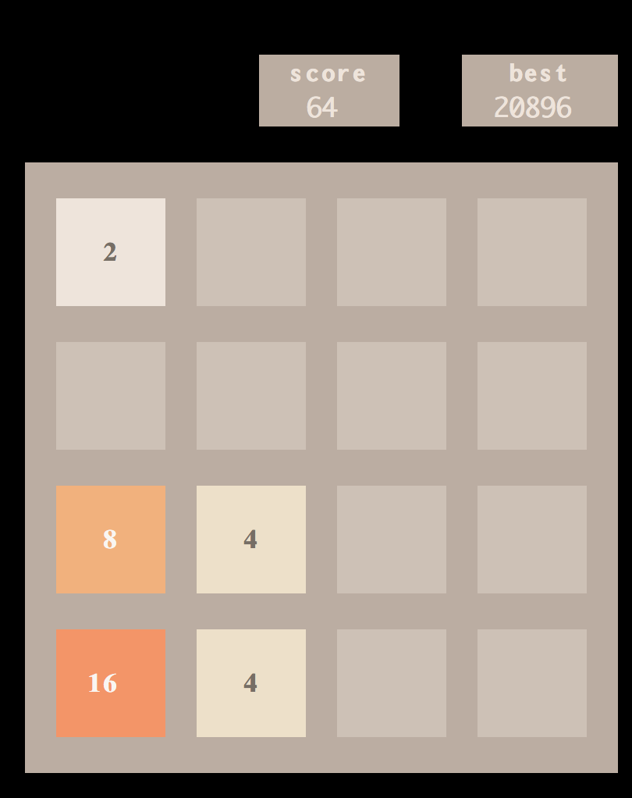
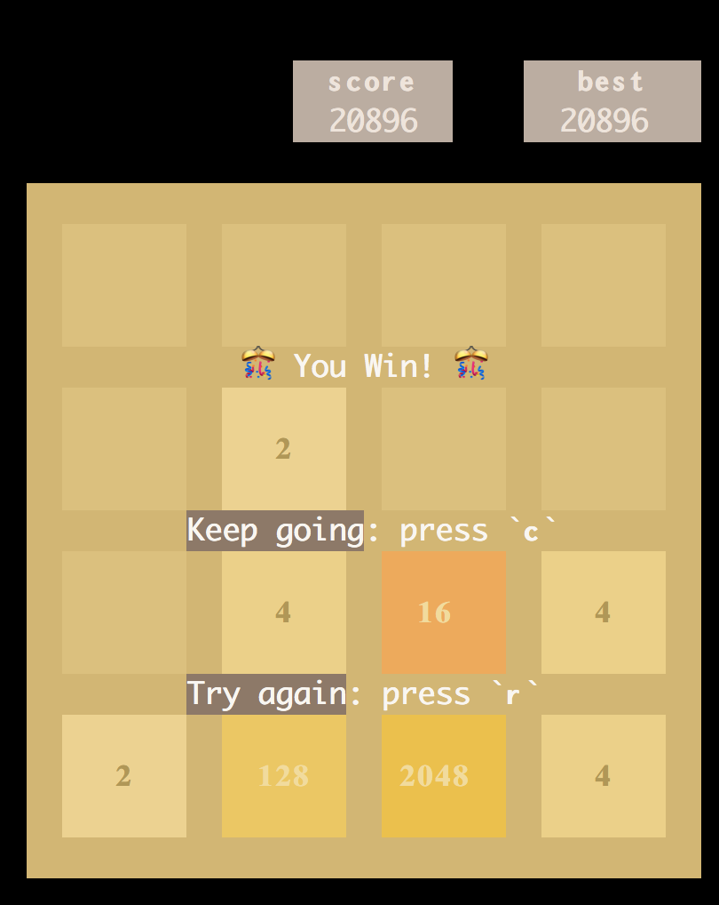
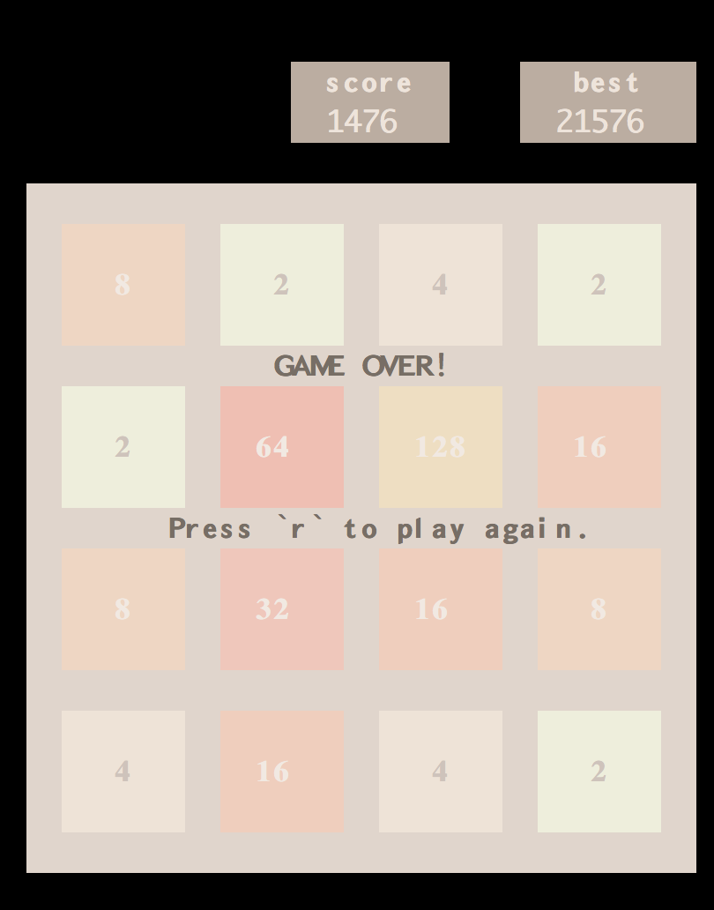

# terminal 2048 game 

This is a [2048 game](https://github.com/gabrielecirulli/2048) clone written in Rust using the `termion` crate that runs in the terminal.

## Screenshots
OnGoing Game               | Won Game                  | Game Over
:-------------------------:|:-------------------------:|:-------------------------:
|| 

> Running on iTerm2.

## Installation

```
git clone $repo
cd $repo
cargo run
```

## NB

This project is a prototype I did for experimenting what it would takes to implement this game using Rust.
It have some issues (resizing, small terminals screens ...) and use inefficient design and algorithms for rendering.
